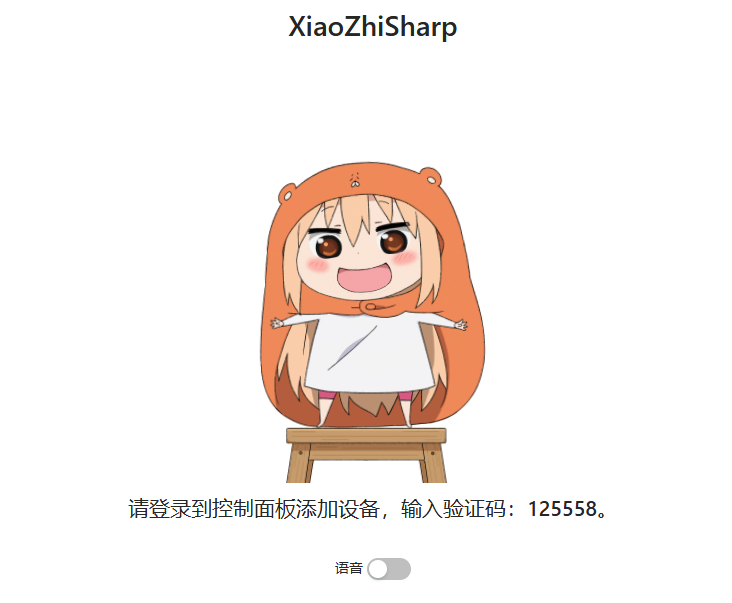
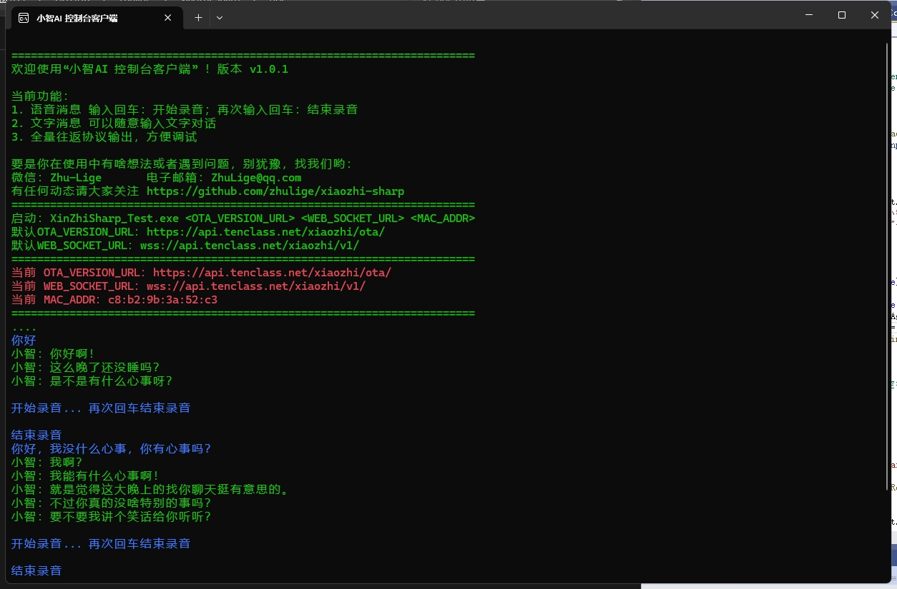
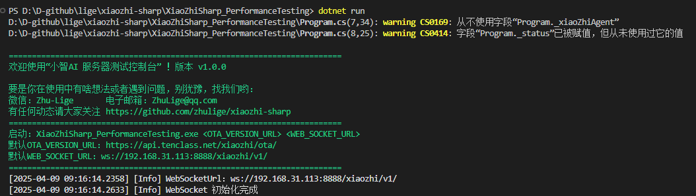
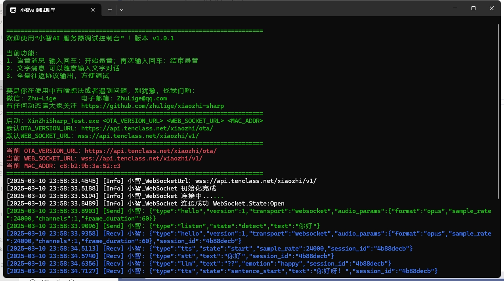

# xiaozhi-sharp 小智 AI 聊天机器人 (XiaoZhi AI Chatbot)
[](http://xiaozhi.nbee.net)

## 前言

本项目是一个AIoT（Artificial Intelligence of Things）项目。

如果你有自己的小智ESP32硬件设备，你可以使用参考以下网址去魔改硬件，让硬件可以随意切换智能体
https://a0qx3jmgsr.feishu.cn/docx/ISjIdiYifoWRZ7xZuU2cwgzynHh<br>
魔改烧录代码开源地址如下：<br>
https://github.com/zhulige/xiaozhi-esp32<br>

**如果你还没有自己的硬件，又想体验一下小智！或者你想在烧录硬件前在线调试一下自己的智能体！欢迎star本项目！**

xiaozhi-sharp 是一个用 C# 精心打造的小智客户端，它不仅可以作为代码学习的优质示例，还能让你在没有相关硬件条件的情况下，轻松体验到小智 AI 

本客户端默认接入 `xiaozhi.me` 官方服务器，为你提供稳定可靠的服务。

如果你想自己创建属于自己专有的智能体，你也可以使用我们提供的:<br>

《小智ESP32 ❤ 扣子Coze X 》中转服务<br>
http://xiaozhi.nbee.net<br>

## 项目结构

```bash
xiaozhi-sharp
├── XiaoZhiSharp (基础库)
├── XiaoZhiSharp_BlazorApp (web应用)
├── XiaoZhiSharp_ConsoleApp (控制台应用)
├── XiaoZhiSharp_PerformanceTesting (服务器性能测试)
├── XiaoZhiSharp_Test (测试)
├── XiaoZhiSharp_MauiApp (跨平台应用)
└── README.md
```

## 运行指南

要运行本项目，你需要确保你的系统已经安装了 .NET Core SDK（推荐安装.net 8.0）。如果尚未安装，可以从 [官方网站](https://dotnet.microsoft.com/zh-cn/) 下载并安装适合你系统的版本。安装成功后，你可以按照以下步骤运行项目：
```bash
cd 到指定目录
dotnet run
```

## 项目组成

### 基础库

你可以使用它很快的创建一个自己的小智客户端应用。

``` C#
using XiaoZhiSharp;
using XiaoZhiSharp.Protocols;

XiaoZhiAgent _xiaoZhiAgent = new XiaoZhiAgent(OTA_VERSION_URL, WEB_SOCKET_URL, MAC_ADDR);
_xiaoZhiAgent.OnMessageEvent += _xiaoZhiAgent_OnMessageEvent;
_xiaoZhiAgent.OnIotEvent += _xiaoZhiAgent_OnIotEvent;
_xiaoZhiAgent.OnAudioEvent += _xiaoZhiAgent_OnAudioEvent;
_xiaoZhiAgent.Start();
```

### 小智Web应用程序 live2d

**功能**
- 支持文字和语音输入
- 支持动态live2d模型

**运行**
```bash
cd XiaoZhiSharp_BlazorApp
dotnet run
```
**效果**

可以语音可以文字输入，还有动态live2d模型可以进行交互。<br>



### 小智控制台程序

**功能**
- 支持文字输入
- 切换不同智能体调试信息

**运行**
```bash
cd XiaoZhiSharp_ConsoleApp
dotnet run
```
**效果**


### 小智AI 服务器压测工具

**功能**
- 通过压力测试确保服务器稳定性<br>

**运行**
```bash
cd XiaoZhiSharp_PerformanceTesting
dotnet run
```
**效果**



### XiaoZhiSharp_Test 小智AI 服务器调试利器
**功能**
- 输出全部指令、让你了解小智的工作原理。<br>

**运行**
```bash
cd XiaoZhiSharp_Test
dotnet run
```
**效果**



### XiaoZhiSharp_MauiApp 小智跨平台AI应用（开发中）

一个跨平台的小智应用，欢迎有兴趣的朋友加入。项目开发中。。。

## 注意事项

请确保你的网络连接正常，这样才能顺利使用小智AI。  
在运行过程中，如果遇到任何问题，可以先查看控制台输出的错误信息，或者检查项目的配置是否正确，例如全局变量 `MAC_ADDR` 是否已经按照要求进行修改。

## 贡献与反馈

如果你在使用过程中发现了项目中的问题，或者有任何改进的建议，欢迎随时提交 Issue 或者 Pull Request。你的反馈和贡献将对项目的发展和完善起到重要的作用。

### 加入社群

欢迎加入我们的社区，分享经验、提出建议或获取帮助！

<div style="text-align: center;">
    
</div>
