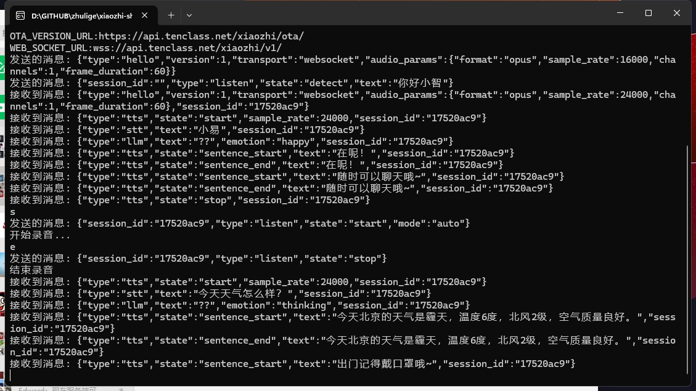

# xiaozhi-sharp 小智 AI 聊天机器人 （XiaoZhi AI Chatbot）
[](https://github.com/xinnan-tech/xiaozhi-esp32-server)

## 项目简介
xiaozhi-sharp 是一个用 C# 精心打造的小智客户端，它不仅可以作为代码学习的优质示例，还能让你在没有相关硬件条件的情况下，轻松体验到小智 AI 带来的智能交互乐趣。
本客户端默认接入 [xiaozhi.me](https://xiaozhi.me/) 官方服务器，为你提供稳定可靠的服务。需要注意的是，为了区分不同的客户端，你需要手动修改全局变量 MAC_ADDR。

## 小智服务器调试利器 XiaoZhiSharp_Test
输出全部指令、让你了解小智的工作原理。拿来就能用还等什么！<br>
<br>



## 运行指南
要运行本项目，你需要按照以下步骤操作：
## 前提条件
确保你的系统已经安装了 .NET Core SDK。如果尚未安装，可以从 官方网站（https://dotnet.microsoft.com/zh-cn/） 下载并安装适合你系统的版本。
## 运行项目：
编译成功后，使用以下命令运行项目：
```
dotnet run
```

项目启动后，你将看到控制台输出相关信息，按照提示进行操作，即可开始与小智 AI 进行畅快的聊天互动。
## 注意事项
请确保你的网络连接正常，这样才能顺利使用小智AI。
在运行过程中，如果遇到任何问题，可以先查看控制台输出的错误信息，或者检查项目的配置是否正确，例如全局变量 MAC_ADDR 是否已经按照要求进行修改。
## 贡献与反馈
如果你在使用过程中发现了项目中的问题，或者有任何改进的建议，欢迎随时提交 Issue 或者 Pull Request。你的反馈和贡献将对项目的发展和完善起到重要的作用。
